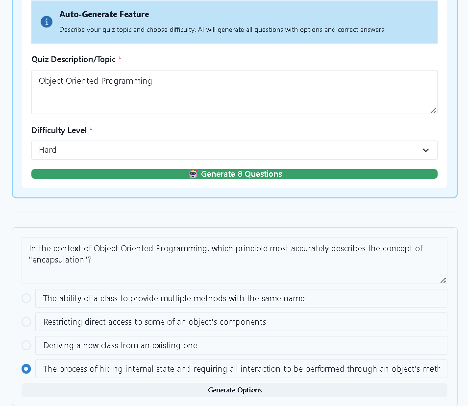

# 📚 Smart QuizApp  

Smart QuizApp is a full-stack web application that enables teachers to **auto-generate quizzes** based on topic and difficulty, and students to **practice quizzes interactively**.  
It uses a **Django backend** with **JWT authentication** and a **React + Chakra UI frontend**, fully containerized with Docker for easy deployment.  

---

## 🚀 Features  

- **Two User Roles**  
  - 👩‍🏫 **Teachers**  
    - Auto-generate quizzes by entering a **topic** and **difficulty level**  
    - Manage quiz content and monitor student results  
  - 👩‍🎓 **Students**  
    - Take quizzes assigned by teachers  
    - Get instant feedback and track performance  

- **Authentication & Security**  
  - Secure login/signup using **JWT (JSON Web Tokens)**  

- **Modern UI**  
  - Built with **React + Chakra UI** for a clean, responsive interface  

- **Containerized Setup**  
  - **Django backend** + **React frontend** + **Database** in Docker containers  
  - Works seamlessly on **Windows** and **Linux** with Docker Compose  

---

## 🛠️ Tech Stack  

- **Frontend**: React, Chakra UI  
- **Backend**: Django REST Framework (DRF)  
- **Authentication**: JWT (JSON Web Token)  
- **Database**: SqlLite3
- **Containerization**: Docker, Docker Compose  
- **AI Integration**: [Puter.js](https://github.com/heyPuter/puter/) (open-source)

---


## ⚙️ Setup Instructions  

### Prerequisites  
- [Docker](https://docs.docker.com/get-docker/) installed  
- [Docker Compose](https://docs.docker.com/compose/install/) installed  

---

### 🖥️ Windows  

```bash
# Clone the repository
git clone https://github.com/yourusername/smart-quizapp.git
cd smart-quizapp

# Run with Docker Compose
docker-compose up
```
🐧 Linux
```bash
# Clone the repository
git clone https://github.com/yourusername/smart-quizapp.git
cd smart-quizapp
# Run with Docker Compose
docker compose up
```
## 📸 Screenshots  

### Teacher – Auto-generate Quiz  
  
